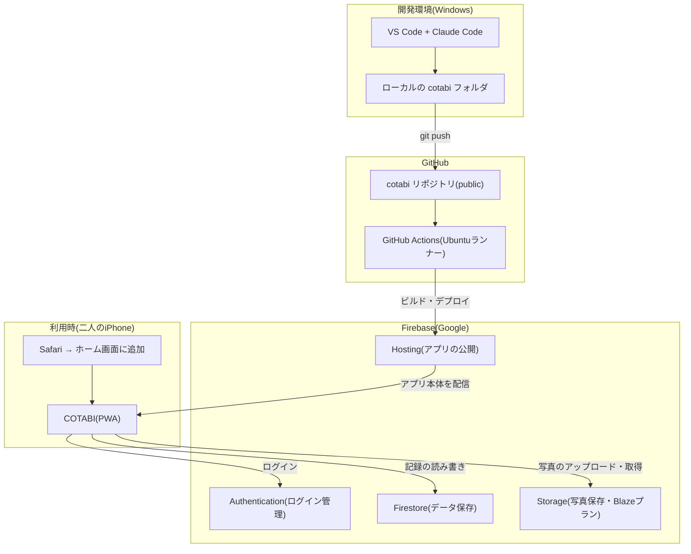
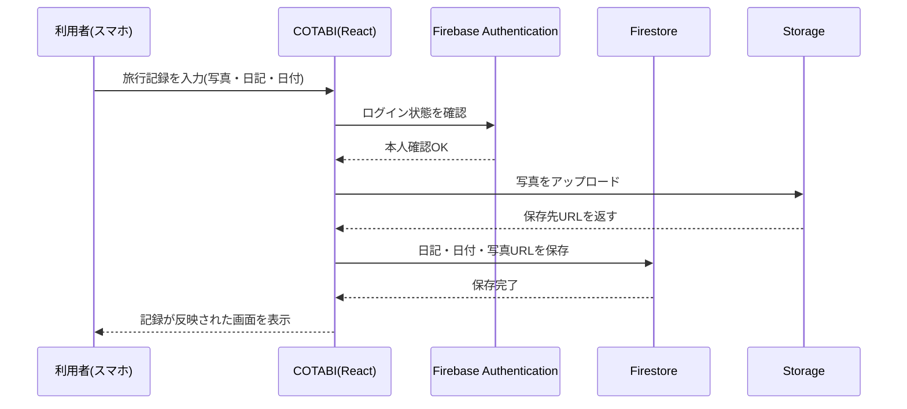

# システム構成図

COTABIの全体構成(開発・デプロイ・利用時のデータの流れ)をまとめたドキュメントです。

## 1. 全体構成図

## 2. 各要素の役割

| 要素 | 役割 |
|---|---|
| VS Code + Claude Code | コードを書く場所。Windows上で完結 |
| GitHubリポジトリ | コードの保管庫。変更履歴を管理 |
| GitHub Actions | pushをきっかけに、自動でビルド・デプロイを実行するロボット |
| Firebase Hosting | 完成したアプリ本体を、実際のURLとして公開する場所 |
| Firebase Authentication | 「本人か彼女か」を確認するログイン機能 |
| Firebase Firestore | 旅行・スポット・日記などの文字データを保存するデータベース |
| Firebase Storage | 写真データを保存する倉庫(容量が大きいためFirestoreとは別管理) |
| 二人のiPhone(Safari) | 実際にアプリを使う場所。ホーム画面に追加してアプリのように利用 |

## 3. データが流れる典型的な例(記録を1件保存する場合)

## 4. なぜこの構成にしたか(経緯の要約)

- 当初はネイティブiOS(SwiftUI)+ CloudKitを想定していたが、無料方針と両立しないことが判明し撤回
- Firebase(Firestore/Auth/Storage)に変更。Storageのみリージョン制約でBlazeプラン(従量課金)登録が必要だが、無料枠内運用+予算アラートで対応
- 無料のApple Developer Personal Teamは証明書が7日で失効する制約があり、ネイティブアプリの長期無料運用が困難と判明したため、**PWA(React + Vite)方式に全面転換**
- 結果として、Mac・Xcode・Apple Developer Programが一切不要な、Windows完結の構成になった
