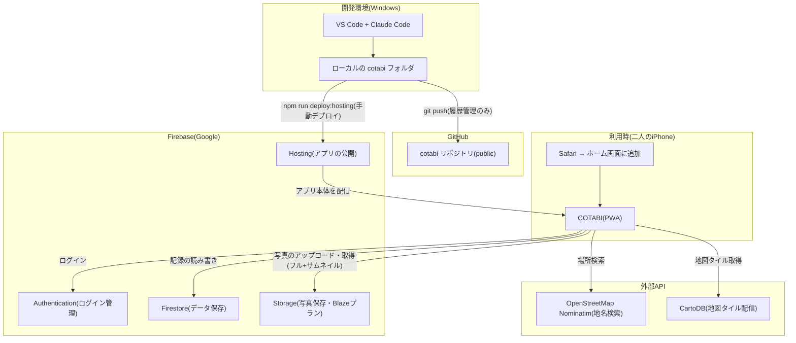
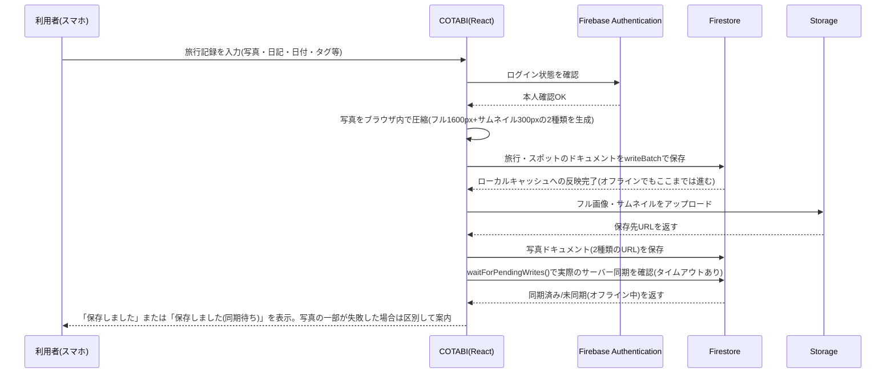
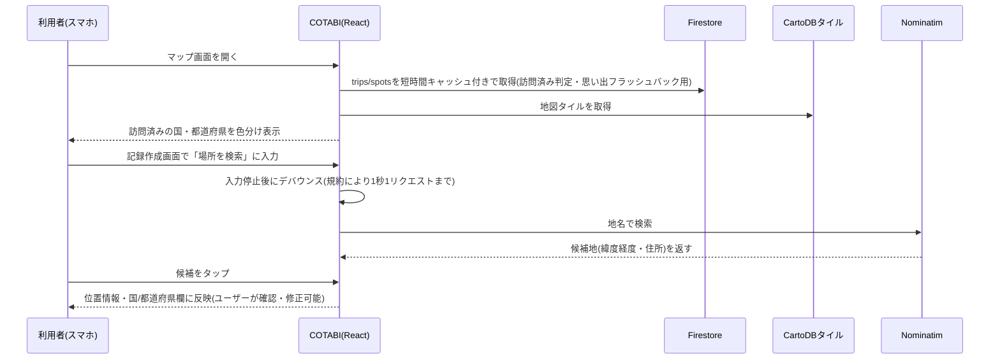

# システム構成図

COTABIの全体構成(開発・デプロイ・利用時のデータの流れ)をまとめたドキュメントです。

## 1. 全体構成図

> **注記(重要)**: 過去の構成案ではGitHub Actionsによるpush連動の自動デプロイを想定していたが、現時点では**未構築**。デプロイは開発者のWindows端末から`npm run deploy:hosting`(ビルド+`firebase deploy --only hosting`)を手動実行して行っている。GitHubリポジトリは現状、コードの履歴管理・保管庫としてのみ機能している。

## 2. 各要素の役割

| 要素 | 役割 |
|---|---|
| VS Code + Claude Code | コードを書く場所。Windows上で完結 |
| GitHubリポジトリ | コードの保管庫。変更履歴を管理(現状、デプロイの自動化はしていない) |
| Firebase Hosting | 完成したアプリ本体を、実際のURLとして公開する場所。開発者端末からの手動デプロイで更新する |
| Firebase Authentication | 「本人か彼女か」を確認するログイン機能(メール/パスワード方式、新規登録機能なし) |
| Firebase Firestore | 旅行(TRIP)・スポット(SPOT)・写真メタデータ(PHOTO)・ウィッシュリスト(WISH)・プライバシーロック設定(users)を保存するデータベース。ブラウザの永続ローカルキャッシュを有効化し、オフラインでの閲覧・書き込みに対応 |
| Firebase Storage | 写真データ(フルサイズ+一覧表示用サムネイルの2種類)を保存する倉庫(容量が大きいためFirestoreとは別管理) |
| OpenStreetMap Nominatim | 記録作成画面・ウィッシュリスト追加画面での地名検索(ジオコーディング)に使う無料API。利用規約に沿ってデバウンス・レート制限を実装 |
| CartoDB | 地図タイル(Voyager、明るい配色・英語表記)の配信元。デザインシステム上、地図タイルのみダーク基調の例外として明るい配色を採用している |
| 二人のiPhone(Safari) | 実際にアプリを使う場所。ホーム画面に追加してアプリのように利用 |

## 3. データが流れる典型的な例

### 3.1 記録を1件保存する場合(写真あり)

### 3.2 地図表示・地名検索

## 4. なぜこの構成にしたか(経緯の要約)

- 当初はネイティブiOS(SwiftUI)+ CloudKitを想定していたが、無料方針と両立しないことが判明し撤回
- Firebase(Firestore/Auth/Storage)に変更。Storageのみリージョン制約でBlazeプラン(従量課金)登録が必要だが、無料枠内運用+予算アラートで対応
- 無料のApple Developer Personal Teamは証明書が7日で失効する制約があり、ネイティブアプリの長期無料運用が困難と判明したため、**PWA(React + Vite)方式に全面転換**
- 結果として、Mac・Xcode・Apple Developer Programが一切不要な、Windows完結の構成になった
- デプロイ自動化(GitHub Actions)は当初の構想として残していたが、実装フェーズでは優先度を下げ、開発者端末からの手動デプロイのまま運用している(必要になれば別途導入を検討)
- 写真表示のパフォーマンス改善のため、アップロード時にフルサイズとは別にサムネイル(長辺300px)を生成する2段構えに変更。一覧・タイムライン・アルバム・思い出フラッシュバックはサムネイルを、スポット詳細はフルサイズを表示する
- 主要画面がFirestoreの同一コレクションを短時間に何度も全件取得してしまう設計上の課題があり、応急処置として`src/lib/queryCache.ts`による短時間キャッシュ(書き込み時に無効化)を導入。根本的な対応(購読方式への切り替え、クエリの絞り込み)は今後の課題として残している
- オフライン時、Firestoreへの書き込みはローカルキャッシュに即時反映され見かけ上は成功するため、`waitForPendingWrites()`を使って実際にサーバーへ同期できたかを確認し、未同期の場合はUI上で案内するようにした。Firebase Storageへの写真アップロードはFirestoreのような offline queue を持たないため、記録本体の保存とは別に成否を扱っている
- プライバシーロック(WebAuthn/PIN)は、サーバーを持たない構成のため署名検証をサーバー側で行えない。プラットフォーム認証器による本人確認をブラウザ自身に保証させる簡易な使い方に留め、「同じ端末をのぞき見されない」用途の範囲でのみ利用している(Firebase Authenticationによる本来のログイン認証とは独立したレイヤー)
