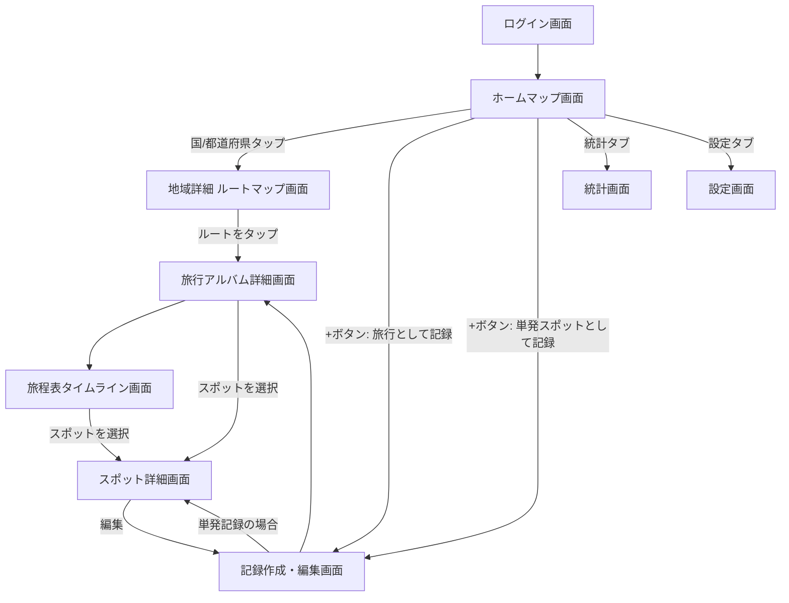
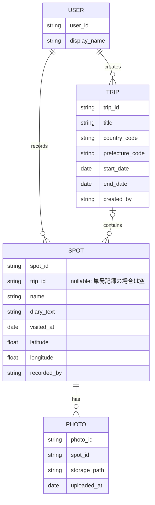

# 画面設計・データモデル仕様書(Phase1) v4

> v4での変更点: アプリ形態をネイティブiOS(SwiftUI)からPWA(React)に変更(詳細は requirements_v5.md 参照)。画面構成・画面遷移・データモデルの内容自体に変更はなく、実装技術の読み替えのみ(例:MapKit→Leaflet)。

## 1. 画面一覧

| No | 画面名 | 概要 |
|---|---|---|
| 1 | ログイン画面 | Firebase Authenticationでの認証(二人だけがログイン可能) |
| 2 | ホーム(マップ)画面 | 世界地図/日本地図を表示し、訪問済みの国・都道府県を色分け。タブで世界⇔日本を切り替え。下タブ「マップ」に該当 |
| 3 | 地域詳細(ルートマップ)画面 | マップで国/都道府県をタップした時に表示。その地域にズームし、旅行ごとに色分けされたルート(複数回訪問時は複数ルート)を地図上に表示 |
| 4 | 旅行(アルバム)詳細画面 | ルートマップでルートをタップした時に表示。1回の旅行の情報、含まれるスポット一覧、旅程表への入口 |
| 5 | 旅程表(タイムライン)画面 | 旅行内のスポットを時系列で一覧表示。日時・スポット名・サムネイル |
| 6 | スポット詳細画面 | 1スポットの記録を表示。写真(複数)・日記文章・日付・位置情報・記録者 |
| 7 | 記録作成・編集画面 | 「旅行を作って複数スポットを追加」または「単発スポットを気軽に記録」の2フローに対応 |
| 8 | 統計画面 | 訪問した国・都道府県の数を表示。下タブ「統計」に該当 |
| 9 | 設定画面 | ログアウト、アカウント情報など。下タブ「設定」に該当 |

### 画面構成の方針
- 下タブは「マップ」「統計」「設定」の3つに絞る(シンプルさ重視)
- 記録の追加は各画面の「+」ボタンから行い、タブは増やさない

## 2. 画面遷移図

## 3. データモデル(ER図)

## 4. データモデル補足

| エンティティ | 説明 |
|---|---|
| USER | 本人・彼女の2レコード固定。表示名を保持 |
| TRIP | 1回の旅行。国コード/都道府県コードに紐づき、訪問マップの色分け判定・ルートマップの色分けに使用 |
| SPOT | 旅行内の1スポット、または単発記録。trip_idがあれば旅行に紐づき、なければ単発記録として扱う。位置情報・日記・記録者を保持 |
| PHOTO | スポットに紐づく写真。Firebase Storageのパスを保持し、複数枚登録可能 |

## 5. 決定事項の反映
- 訪問済み判定ルール:単発記録・旅行内スポットを問わず、**一度でもその国/都道府県にスポットが記録されたら「訪問済み」**として扱う(trip_idの有無は問わない)
- 統計画面の集計ルール:訪問済み判定と同じルールで統一(単発記録も集計に含める)
- ルートマップの色分けルール:固定パレットを旅行の登録順に自動割り当て(ユーザーによる色選択は行わない)

## 6. 未確定事項
特になし(Phase1の画面設計・データモデルはこの内容で確定)
