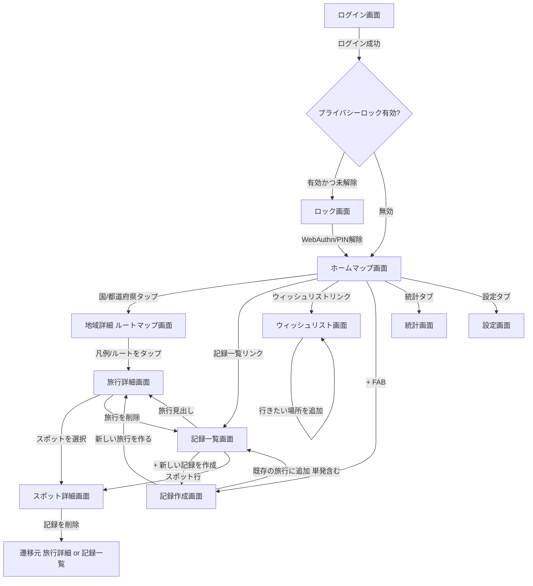
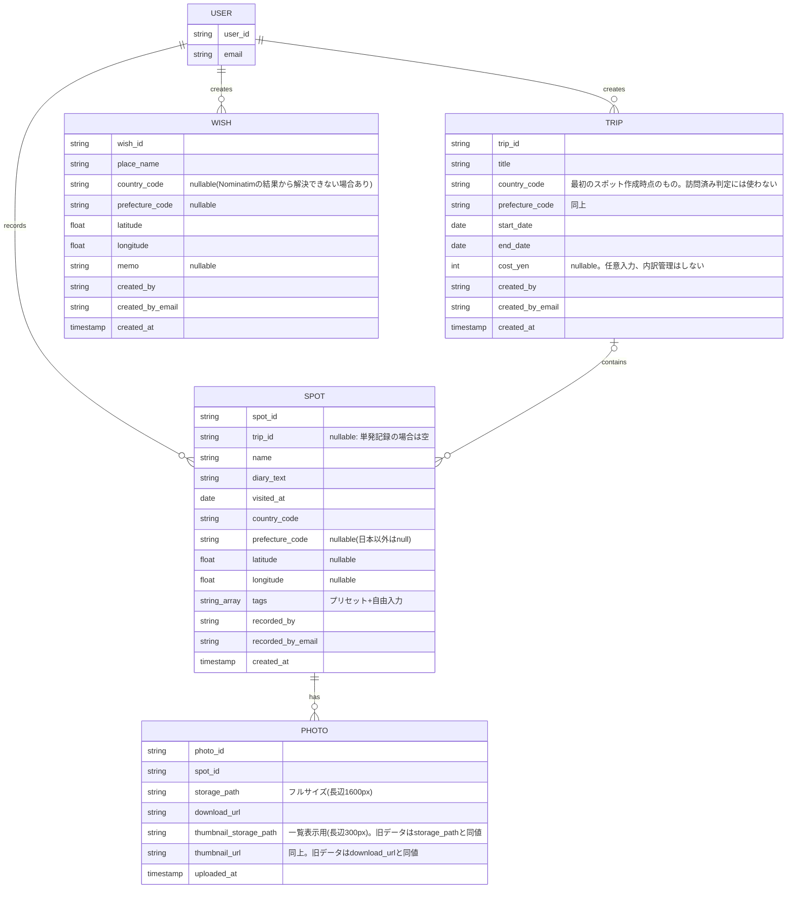

# 画面設計・データモデル仕様書 v5

> v5での変更点: Phase2・Phase3の実装により追加された画面(ロック画面、ウィッシュリスト画面)・機能(絞り込みパネル、確認ダイアログ、費用編集、削除、タグ表示等)をすべて反映した。データモデルに`Wish`エンティティ、`TRIP.cost_yen`、`SPOT.tags`、`PHOTO`のサムネイル関連フィールドを追加した。画面構成の基本方針(下タブ3つ、+ボタンでの記録追加)に変更はない。

## 1. 画面一覧

| No | 画面名 | 概要 | 実装ファイル |
|---|---|---|---|
| 1 | ログイン画面 | Firebase Authenticationでの認証(二人だけがログイン可能。新規登録機能はない) | `LoginScreen` |
| 2 | ロック画面 | プライバシーロックが有効な場合に、ログイン後・バックグラウンド復帰後に表示。WebAuthn優先、失敗/未設定時はPIN入力 | `LockScreen` |
| 3 | ホーム(マップ)画面 | 世界地図/日本地図を表示し、訪問済みの国・都道府県を色分け。世界⇔日本トグル、大陸絞り込み、思い出フラッシュバックカード、記録一覧/ウィッシュリストへの導線、記録作成FABを配置。下タブ「マップ」に該当 | `MapScreen` |
| 4 | 地域詳細(ルートマップ)画面 | マップで国/都道府県をタップした時に表示。その地域にズームし、旅行ごとに色分けされたルート(複数回訪問時は複数ルート)を地図上に表示。凡例から旅行詳細へ遷移可能 | `RegionDetailScreen` |
| 5 | 旅行詳細画面 | 旅行の基本情報(タイトル・訪問地・期間・費用)、タイムライン/アルバムの切り替え表示、旅行の削除を扱う | `TripDetailScreen` |
| 6 | スポット詳細画面 | 1スポットの記録を表示。写真(複数・フル画質)・日記文章・日付・位置情報・タグ・記録者、スポットの削除を扱う | `SpotDetailScreen` |
| 7 | 記録作成画面 | 「新しい旅行を作る(複数スポットをまとめて登録)」または「既存の旅行に追加(単発スポット含む)」の2モードに対応。国・都道府県・タグの選択、地名検索(Nominatim)による位置情報設定、写真選択、費用入力(新規旅行時)を含む | `RecordFormScreen` |
| 8 | 記録一覧画面 | 全記録を旅行単位でグループ化して一覧表示。日付範囲・国/都道府県・タグによる絞り込みパネルを持つ | `RecordListScreen` |
| 9 | ウィッシュリスト画面 | 「次はここに行きたい」場所の地図表示・一覧・追加(Nominatim検索)・削除 | `WishlistScreen` |
| 10 | 統計画面 | 訪問した国・都道府県の数、全旅行の費用合計を表示。下タブ「統計」に該当 | `StatsScreen` |
| 11 | 設定画面 | プライバシーロックの設定(オン/オフ、PIN再設定、生体認証の登録/解除)、ログアウト、利用データの出典表示(都道府県境界データ・Nominatim)。下タブ「設定」に該当 | `SettingsScreen` |

### 横断的に使うUIコンポーネント

| コンポーネント | 用途 |
|---|---|
| `BottomTabBar` | 下タブ(マップ/統計/設定)。ロック画面・ログイン画面には表示しない |
| `BackLink` | 「戻る」リンク。ブラウザの実際の履歴を1つ戻る(`navigate(-1)`)。アプリ内履歴が無い場合(ディープリンク等)のみ、指定のフォールバック先へ遷移する |
| `ConfirmDialog` | 削除など取り消せない操作の前に必ず挟む確認モーダル。`window.confirm()`は使わず、design_system.mdのトーンに合わせた独自コンポーネントに統一している(スポット詳細・旅行詳細・ウィッシュリストの削除で採用) |
| `Combobox` | 国・都道府県などの選択を、入力しながら絞り込める検索可能な自作コンボボックス(追加ライブラリなし) |
| `SpotFields` | スポット単位の入力欄(国・都道府県・スポット名・日付・日記・タグ・位置情報・写真)。記録作成画面で複数配置される |
| `GeoMap` | 世界地図・日本地図(国/都道府県ポリゴンの色分け表示)。GeoJSON読み込み中/失敗時のオーバーレイ(失敗時は再試行ボタン)を内蔵 |
| `RouteMap` | 地域詳細画面のルートマップ(旅行ごとの色分けルート・ピン表示) |
| `WishlistMap` | ウィッシュリストのピン表示専用マップ(点線アウトラインのマーカー) |
| `FlashbackCards` | マップ画面上部の「〇年前の今日」カード列 |

### 画面構成の方針
- 下タブは「マップ」「統計」「設定」の3つに絞る(シンプルさ重視)
- 記録の追加は各画面の「+」ボタン(マップ画面のFAB、記録一覧画面の追加リンク)から行い、タブは増やさない
- 削除のような取り消せない操作は、通常のゴールドのボタンとは視覚的・配置的に分離し(画面下部・控えめな赤系アウトライン)、必ず`ConfirmDialog`での確認を挟む

## 2. 画面遷移図

## 3. データモデル(ER図)

## 4. データモデル補足

| エンティティ | 説明 |
|---|---|
| USER | 本人・彼女の2レコード固定。Firebase Authenticationのユーザーそのものであり、専用コレクションは持たない(プライバシーロック設定のみ`users/{uid}`ドキュメントに保持) |
| TRIP | 1回の旅行。`country_code`/`prefecture_code`は最初のスポット作成時点の値を保持するのみで、**訪問済み判定・統計集計・ルート色分けの判定には使わない**(1つの旅行が複数国にまたがることがあるため) |
| SPOT | 旅行内の1スポット、または単発記録。`trip_id`があれば旅行に紐づき、なければ単発記録として扱う。位置情報・日記・タグ・記録者を保持し、`country_code`/`prefecture_code`は`trip_id`の有無によらず必ず持つ |
| PHOTO | スポットに紐づく写真。フルサイズとサムネイル(一覧・タイムライン・アルバム・思い出フラッシュバック表示用)の2種類をFirebase Storageに保存し、両方のURLをドキュメントに保持する |
| WISH | 「次はここに行きたい」場所。TRIP/SPOTとは別コレクション(`wishes`)で管理し、訪問済みへの自動変換機能は持たない(実際に訪れた後は、記録作成後に手動で削除する運用) |

## 5. 決定事項の反映

- **訪問済み判定ルール**: 単発記録・旅行内スポットを問わず、**一度でもその国/都道府県にスポットが記録されたら「訪問済み」**として扱う(`trip_id`の有無・TRIPドキュメント自身の`country_code`は一切参照しない)
- **統計画面の集計ルール**: 訪問済み判定と同じルールで統一(単発記録も集計に含める)。あわせて全旅行の`cost_yen`(入力されているもののみ)の合計を表示する
- **ルートマップの色分けルール**: 固定パレットを旅行の**全体での作成順(`created_at`昇順)**に自動割り当て(ユーザーによる色選択は行わない)。地域詳細画面では、SPOT側の`country_code`/`prefecture_code`が一致するスポットのみを抽出してルートを構成する(TRIPの代表国コードでは絞り込まない)
- **タグ**: プリセット(グルメ/絶景/記念日/ホテル/観光地)+自由入力。タグでの検索・絞り込みはPhase3で実装済み(記録一覧画面)
- **ウィッシュリストのピン**: 訪問済み(ゴールド塗りつぶし)と明確に区別するため、点線アウトラインのマーカーを使用する
- **オフライン時の保存**: Firestoreへの書き込みはオフラインでもローカルキャッシュには即時反映されるため、保存直後に`waitForPendingWrites()`で実際にサーバーへ同期済みかどうかを確認し、未同期の場合はその旨をトーストで案内する。写真(Storage)のアップロードはオフラインでは失敗するため、記録本体の保存とは切り分けて成否を扱い、「記録は保存されたが一部の写真は保存できなかった」旨を区別して案内する

## 6. 未確定事項
特になし。Phase1〜3の画面設計・データモデルはこの内容で確定。Phase4(動画対応・コメント・OCR・プッシュ通知)の画面設計は、各機能の実装着手時に別途詰める。
